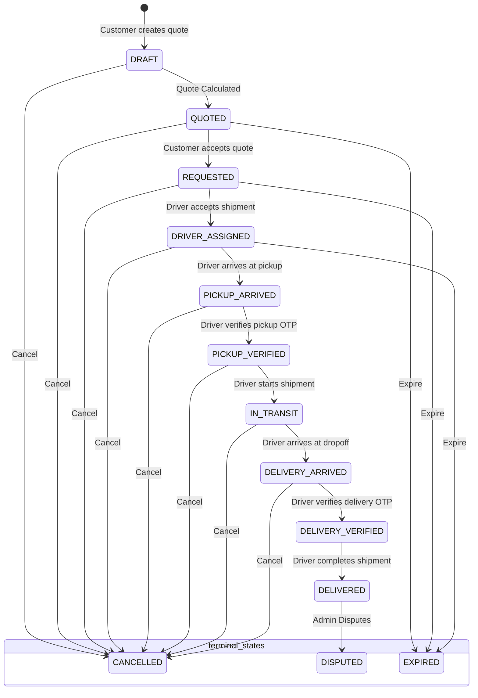

# RYDALUX Shipment Module Documentation

Welcome to the comprehensive technical documentation for the RYDALUX Shipment Module. This module governs the foundation, lifecycle, routing, access controls, and verifications for parcel logistics and delivery services within the RYDALUX ecosystem.

---

## 1. Product Overview

The Shipment Module allows customers (riders) to safely request and track the transport of packages, documents, and other parcels from a designated pickup address to a dropoff address. 

Key pillars of the product include:
- **Instant Pricing Quotes:** Real-time distance and category-based pricing calculation.
- **Double-Sided Verification:** Hashed numeric OTP generation for both package pickup and final delivery.
- **Secure Chain of Custody:** Enforced status updates, proof uploading, and private location tracking events.
- **Scrubbed Available Queue:** Protection of sensitive recipient identity details from unassigned drivers.
- **Admin Support Integration:** Immediate ticket linkage and dispute mapping with full actor audit trails.

---

## 2. Architecture Overview

The Shipment Module resides entirely within the `@rydulux/api-services-local` package under the NestJS framework. It is modularly split across multiple files to guarantee separation of concerns, secure role routing, and prevent route shadowing:

```
services/api/src/shipments/
├── dto/                             # Data Transfer Objects for validation
│   ├── admin-shipment-list-query.dto.ts
│   ├── assign-shipment-driver.dto.ts
│   ├── cancel-shipment.dto.ts
│   ├── create-shipment-quote.dto.ts
│   ├── create-shipment-support-ticket.dto.ts
│   ├── create-shipment.dto.ts
│   ├── dispute-shipment.dto.ts
│   ├── shipment-list-query.dto.ts
│   ├── shipment-photo-upload-request.dto.ts
│   ├── shipment-proof.dto.ts
│   ├── update-shipment-status.dto.ts
│   └── verify-shipment-otp.dto.ts
├── shipments.rider.controller.ts     # Customer/Rider endpoints (/shipments)
├── shipments.driver.controller.ts    # Driver endpoints (/driver/shipments)
├── shipments.admin.controller.ts     # Administrator endpoints (/admin/shipments)
├── shipments.service.ts              # Core shipment business logic
├── shipment-otp.service.ts           # Secure OTP generation & verify logic
├── shipment-quote.service.ts         # Real-time pricing calculations
├── shipment-state-machine.ts         # Transition validator for the 13 states
└── shipments.module.ts               # Component registrations and linkages
```

---

## 3. Prisma Models Overview

The Shipment Module relies on several closely linked relational models within PostgreSQL:

### `Shipment`
The central model tracking package categories, names, fares, status, and verification timestamps.
- **1-to-1 with `Trip`:** Bridges shipments with the global RYDALUX trip tracking system.
- **1-to-1 with `ShipmentQuote`:** Captures calculated fares, expiry, and acceptances.
- **1-to-many with `ShipmentOtp`:** Hashed authentication records for pickup and delivery.
- **1-to-many with `ShipmentProof`:** Verified URLs for signed photos uploaded during delivery.
- **1-to-many with `ShipmentPhoto`:** Package state validation photos.
- **1-to-many with `ShipmentTrackingEvent`:** Audit log of all shipment transitions.

### `ShipmentQuote`
Saves calculated fares, surge multipliers, distance, and expiry details. Must be accepted within 30 minutes of creation.

### `ShipmentOtp`
Stores the **one-way bcrypt hashes** (`otpHash`) of 6-digit numeric codes generated for `'PICKUP'` and `'DELIVERY'` verifications. **Never stores raw codes.**

### `ShipmentProof`
Tracks driver-submitted proof images (`PHOTO_URL`) along with GPS coordinates and driver descriptions.

### `ShipmentTrackingEvent`
Audits every state transition, failed OTP entry, or uploaded image with timestamps.

---

## 4. Statuses and State Diagram

Shipments have a robust **13-state lifecycle** mapped directly to the underlying `TripStatus`:



---

## 5. Valid State Transitions

The `ShipmentStateMachine` enforces strict transition paths to prevent state hijacking:

| Current Status | Allowed Next Statuses |
| :--- | :--- |
| `DRAFT` | `QUOTED`, `CANCELLED` |
| `QUOTED` | `REQUESTED`, `CANCELLED`, `EXPIRED` |
| `REQUESTED` | `DRIVER_ASSIGNED`, `CANCELLED`, `EXPIRED` |
| `DRIVER_ASSIGNED` | `PICKUP_ARRIVED`, `CANCELLED`, `EXPIRED` |
| `PICKUP_ARRIVED` | `PICKUP_VERIFIED`, `CANCELLED` |
| `PICKUP_VERIFIED` | `IN_TRANSIT`, `CANCELLED` |
| `IN_TRANSIT` | `DELIVERY_ARRIVED`, `CANCELLED` |
| `DELIVERY_ARRIVED` | `DELIVERY_VERIFIED`, `CANCELLED` |
| `DELIVERY_VERIFIED` | `DELIVERED` |
| `DELIVERED` | None (Terminal) |
| `CANCELLED` | None (Terminal) |
| `DISPUTED` | None (Terminal) |
| `EXPIRED` | None (Terminal) |

---

## 6. Rider/Customer Flow

1. **Calculate Quote:** Rider supplies locations, parcel category, priority, and weight. The API returns a non-expired `ShipmentQuote` along with a draft `shipmentId`.
2. **Confirm Request:** Rider accepts the quote before it expires (30 minutes). The shipment enters `REQUESTED` and secure hashed verification codes are generated. The rider is shown these codes **once** to give to the sender/recipient.
3. **Tracking & Support:** Rider can view shipment progress safely, request package upload placeholders, or open a linked support ticket if issues arise.
4. **Cancellation:** Riders can cancel the shipment at any point before `DELIVERY_VERIFIED`.

---

## 7. Driver Flow

1. **Search Queue:** Offline/online drivers search available shipments. They see pickup/dropoff points and package size, but recipient phone/name are **hidden**.
2. **Acceptance:** Driver accepts the shipment, entering `DRIVER_ASSIGNED`. They are granted access to full shipment details.
3. **Pickup:** Driver arrives at pickup, verifies sender's 6-digit OTP code, and starts the shipment to enter `IN_TRANSIT`.
4. **Delivery:** Driver arrives at delivery, submits package proof image, verifies recipient's 6-digit OTP, and marks the shipment as `DELIVERED`.

---

## 8. Admin Flow

- **Monitoring:** Admins list, search, and view complete details of all shipments.
- **Force Assignment:** Force-assign an available driver to a requested shipment.
- **Manual status changes:** Force-cancel, dispute, or patch status according to the valid state machine paths.
- **Auditing:** All admin operations automatically register an `AuditLog` mapping the admin user and payload parameters.

---

## 9. Quote Flow

The quote calculations combine:
- **Base Fare:** 500 NGN minimum.
- **Distance Fare:** 50 NGN per kilometer (Haversine formula approximation).
- **Category Surcharges:** `DOCUMENT` (0), `SMALL_PACKAGE` (+100), `MEDIUM_PACKAGE` (+200), `LARGE_PACKAGE` (+500), `FRAGILE` (+300), `HIGH_VALUE` (+400).
- **Weight Fare:** +10 NGN per kg.
- **Priority Multiplier:** `STANDARD` (1.0), `EXPRESS` (1.5), `SCHEDULED` (0.9).

---

## 10. OTP Flow

Security is maintained via double-blind OTP verifications:
1. `ShipmentOtpService` generates random 6-digit OTP codes.
2. The code is hashed using `bcrypt` (10 salt rounds) and saved to the `ShipmentOtp` database table. The raw code is **never saved**.
3. During verification, `bcrypt.compare` validates driver input against the DB hash.
4. Attempts are tracked and limited to a maximum of **3 attempts** per OTP type. Expiry is enforced at **15 minutes**.

---

## 11. Pickup Proof Flow

1. Driver arrives at the pickup location (`PICKUP_ARRIVED`).
2. Driver requests the sender for the **Pickup OTP**.
3. Driver verifies the OTP. If valid, the shipment transitions to `PICKUP_VERIFIED` and the driver is allowed to start the delivery.

---

## 12. Delivery Proof Flow

1. Driver arrives at the dropoff location (`DELIVERY_ARRIVED`).
2. Driver takes a photo of the parcel/recipient and uploads it via `/proof`.
3. Driver requests the recipient for the **Delivery OTP**.
4. Driver verifies the OTP to transition to `DELIVERY_VERIFIED`.
5. Driver completes the shipment to enter `DELIVERED` and trigger payment capture.

---

## 13. Photo Upload Placeholder Flow

1. Rider requests a placeholder via `/photos/request-upload` providing parcel type and mimeType.
2. The server records a `ShipmentPhoto` entry and returns a **mock signed upload URL** (e.g. `https://rydalux-storage.local/upload/...`).
3. The rider uploads the asset to the placeholder bucket securely.

---

## 14. Tracking Event Behavior

Every critical lifecycle transition records a `ShipmentTrackingEvent` including:
- `eventType` (`STATUS_CHANGED`, `OTP_VERIFIED`, `OTP_FAILED`, `PROOF_UPLOADED`, `PHOTO_UPLOAD_REQUESTED`)
- `status` (The active ShipmentStatus state)
- `metadata` JSON blob capturing contextual ids, errors, or details.

---

## 15. Audit Log Behavior

Admin actions trigger a persistent `AuditLog` entry tracking:
- `actorId` (The Admin's user ID)
- `action` (e.g. `SHIPMENT_ADMIN_ASSIGN_DRIVER`, `SHIPMENT_FORCE_CANCELLED`)
- `entityId` & `entity` (`SHIPMENT`)
- `payload` JSON containing changes made.

---

## 16. Support Ticket Linkage

When a rider creates a support ticket, it is mapped to both the `Shipment` and the underlying `Trip`:
- `type` is automatically set to `SHIPMENT_ISSUE`.
- Links are established to preserve private admin-only notes (`isInternal`) and separate them from public communications.

---

## 17. Payment Linkage Notes

- Upon `createShipment` transition to `REQUESTED`, the service calls `PaymentsService.initiateMockPayment` to authorize/hold funds.
- Upon `completeShipment` transition to `DELIVERED`, the service captures the authorized funds via `PaymentsService.capturePaymentForTrip` and credits the driver's earnings.

---

## 18. Security Rules

> [!IMPORTANT]
> **Strict OTP Protections:**
> - **No raw OTP storage:** OTPs are hashed on creation and the raw digits discarded.
> - **No hash exposure:** Hashed values are excluded from shape methods and never returned in API payloads.

> [!WARNING]
> **Privacy & Scraping Guardrails:**
> - **Driver Queue Scrubbing:** Recipient details (`recipientName`, `recipientPhone`) in `GET /driver/shipments/available` are completely masked (`***`).
> - **Signed upload placeholders:** Pre-signed storage URLs are short-lived, preventing public URL scanning.

---

## 19. Endpoint Reference

### Rider Endpoints (Prefix: `/shipments`)
- `POST /quote` - Generate shipment quote.
- `POST /` - Request shipment using valid quote.
- `GET /` - List rider shipments (paginated).
- `GET /active` - Get active rider shipment.
- `GET /:id` - Get detail of a specific shipment.
- `GET /:id/codes` - Get trip PIN code details.
- `POST /:id/cancel` - Cancel a shipment.
- `POST /:id/photos/request-upload` - Request signed photo upload URL.
- `POST /:id/support-ticket` - File support ticket linked to shipment.

### Driver Endpoints (Prefix: `/driver/shipments`)
- `GET /available` - List available requested shipments (scrubbed).
- `GET /active` - Get assigned active shipment.
- `GET /:id` - View assigned shipment details.
- `POST /:id/accept` - Accept available shipment.
- `POST /:id/arrive-pickup` - Arrive at pickup.
- `POST /:id/verify-pickup-otp` - Verify pickup OTP code.
- `POST /:id/start` - Start shipment (requires verified pickup).
- `POST /:id/arrive-delivery` - Arrive at dropoff.
- `POST /:id/verify-delivery-otp` - Verify delivery OTP code.
- `POST /:id/complete` - Complete shipment (requires verified delivery & proof).
- `POST /:id/proof` - Upload proof photo.

### Admin Endpoints (Prefix: `/admin/shipments`)
- `GET /` - List all shipments.
- `GET /:id` - View any shipment details.
- `POST /:id/assign-driver` - Force-assign a driver.
- `POST /:id/cancel` - Force-cancel a shipment.
- `POST /:id/dispute` - Place shipment in dispute.
- `PATCH /:id/status` - Manually update status using state-machine checks.

---

## 20. Example Requests/Responses

### Request Quote (`POST /shipments/quote`)
```json
{
  "pickupLatitude": 6.5244,
  "pickupLongitude": 3.3792,
  "dropoffLatitude": 6.4281,
  "dropoffLongitude": 3.4653,
  "packageCategory": "SMALL_PACKAGE",
  "priority": "STANDARD",
  "weight": 2.5
}
```

Response:
```json
{
  "shipmentId": "8fa8fb92-127e-40fa-aa1a-b6ea3f2cf190",
  "quote": {
    "id": "e8e5860e-2495-4676-9c4c-70e1765c71b6",
    "baseFare": 500,
    "distanceFare": 605,
    "categoryFare": 100,
    "weightFare": 25,
    "surgeMultiplier": 1,
    "totalFare": 1230,
    "distance": 12.1,
    "expiresAt": "2026-05-30T04:00:00.000Z"
  }
}
```

### Request Shipment (`POST /shipments`)
```json
{
  "quoteId": "e8e5860e-2495-4676-9c4c-70e1765c71b6",
  "pickupAddress": "12 Herbert Macaulay Way, Yaba, Lagos",
  "dropoffAddress": "5 Adeniran Ogunsanya St, Surulere, Lagos",
  "senderName": "Alice Smith",
  "recipientName": "Bob Johnson",
  "recipientPhone": "+2348011223344",
  "packageCategory": "SMALL_PACKAGE",
  "priority": "STANDARD",
  "packageDescription": "Birthday Gift Box",
  "specialInstructions": "Call recipient on arrival"
}
```

Response:
```json
{
  "id": "8fa8fb92-127e-40fa-aa1a-b6ea3f2cf190",
  "status": "REQUESTED",
  "pickupOtp": "784912",
  "deliveryOtp": "395018",
  "fare": {
    "totalFare": 1230
  }
}
```

---

## 21. Error Handling

Standard HTTP status codes are raised:
- **`400 Bad Request`:** Raised on invalid coordinates, expired quotes, invalid status transitions, or wrong OTP verification codes.
- **`403 Forbidden`:** Raised on unauthenticated requests, unauthorized access to another user's shipment, or unassigned driver attempts.
- **`404 Not Found`:** Raised on invalid shipment, quote, or driver ids.

---

## 22. Known Limitations

- **Upload Handlers:** Photos and proofs currently return static storage key placeholders (`rydalux-storage.local`). Real cloud integration (S3/MinIO signed URLs) is mapped to subsequent phases.
- **Database Migrations:** Tests depend on local postgres states. Sourcing migrations locally is required for integration tests to pass.

---

## 23. Future Enhancements

- **Real Cloud Uploads:** Implement active AWS S3/MinIO bucket generation and verification.
- **Live Driver Dispatch:** Automate notifications and dispatch routing using active sockets.
- **Mobile & Admin shipment UI:** Build dedicated shipment setup forms and admin dashboards.
- **Shipment Pricing Engine Enhancement:** Hook into dynamic surge factors and urban traffic zone weightings.
