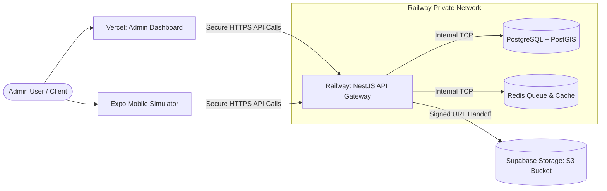

# RYDALUX Staging Infrastructure Decision Record

This document evaluates the cloud hosting platforms and architecture strategies available to host the RYDALUX staging environment. It details comparative scoring, latency implications for the Lagos pilot, cost estimates, and outlines the chosen staging architecture.

---

## 1. Staging Architecture Requirements

The RYDALUX ecosystem consists of several interconnected components, each with unique hosting needs:

*   **NestJS Backend API**: Highly concurrent containerized service running on Node.js 20. Needs direct private access to database and cache resources.
*   **Next.js Admin Dashboard**: Static/SSR-capable web application built with Next.js 14.
*   **PostgreSQL Database**: Must support the **PostGIS** extension for geographic query processing (e.g. driver coordinates, geofences, and route tracking).
*   **Redis Cache & Queue**: Active session storage and task queue processor (BullMQ).
*   **Object Storage**: S3-compatible service to house KYC documents and delivery signature proofs.
*   **Logging & Monitoring**: Basic telemetry to diagnose API lifecycle health and crash logs.

---

## 2. Staging Infrastructure Options Evaluation

We evaluated six popular infrastructure solutions against the requirements of our staging phase.

### Option A: Railway
*Integrated PaaS offering instant private networking, database provisioning, and git-triggered auto-deployments.*
*   **Pros**: Private networking connects API, Postgres, and Redis automatically with zero configuration. PostGIS is supported natively. Exceptional developer experience (DX).
*   **Cons**: Pricing shifts from flat-rate to metered resource consumption after credit usage. No native African datacenter (closest is EU-West / London).

### Option B: Render
*A robust managed PaaS alternative providing simple container hosting and managed databases.*
*   **Pros**: Flat-rate pricing tiers. Simple Git-to-deploy pipelines. Excellent management dashboard.
*   **Cons**: Free tiers sleep (30s cold starts). Private networking between independent web services and Redis is less seamless than Railway.

### Option C: Fly.io
*Global application platform that deploys microVMs on the edge closest to users.*
*   **Pros**: Exceptional geolocated edge latency. Offers South Africa (`jnb`) region, providing low latency to Lagos.
*   **Cons**: Operations are CLI-heavy. Managing high-availability Postgres clustering and volume attachments adds significant configuration overhead.

### Option D: Supabase + Vercel
*Serverless-first approach combining Supabase (Postgres + PostGIS + Storage) and Vercel (Next.js + serverless functions).*
*   **Pros**: Supabase provides a powerful, pre-configured Postgres database with PostGIS and instant S3-like storage. Vercel is the gold standard for Next.js dashboards.
*   **Cons**: NestJS runs poorly on serverless functions due to cold starts and database connection pool exhaustion. Requires running NestJS on a separate hosting provider.

### Option E: AWS (Lightsail / ECS / RDS)
*The enterprise industry standard for cloud computing.*
*   **Pros**: Identical to our long-term production path. Maximum reliability, security, and scalability.
*   **Cons**: Highest complexity. Provisioning VPCs, IAM roles, ECS tasks, and RDS instances takes days of engineering effort. The minimum cost boundary for a basic staging setup is high ($50+/month).

### Option F: DigitalOcean App Platform
*A mid-tier managed Kubernetes PaaS with integrated managed databases.*
*   **Pros**: Predictable flat pricing. Easily scales to dedicated droplets. Full support for PostGIS and managed Redis.
*   **Cons**: Deployment pipelines are noticeably slower than Railway/Render. UI is less responsive for multi-service debugging.

---

## 3. Comparison & Scoring Matrix

Each hosting option is scored from **1 (Poor)** to **5 (Excellent)** across our core staging metrics:

| Metric | Railway | Render | Fly.io | Supabase + Vercel | AWS | DigitalOcean |
| :--- | :---: | :---: | :---: | :---: | :---: | :---: |
| **Cost** | 4 | 4 | 4 | 5 (free tier) | 2 | 3 |
| **Setup Simplicity** | 5 | 4 | 3 | 4 | 1 | 3 |
| **PostGIS Support** | 5 | 5 | 4 | 5 | 5 | 5 |
| **Redis Integration** | 5 | 4 | 3 | 1 (no Redis) | 4 | 4 |
| **Deployment Speed** | 5 | 4 | 4 | 5 | 2 | 3 |
| **Developer Experience** | 5 | 4 | 3 | 5 | 2 | 3 |
| **Lagos Latency (RTT)** | 4 | 4 | 5 (`jnb` edge) | 4 | 4 | 4 |
| **Production Path** | 3 | 3 | 4 | 3 | 5 | 4 |
| **TOTAL SCORE** | **36** | **32** | **30** | **32** | **25** | **29** |

### Lagos/Africa Latency Considerations
While Fly.io offers South Africa (`jnb`) regions, their core database clusters are most cost-effective when located in Europe. For staging, the round-trip latency (RTT) from Lagos to European datacenters (e.g. `eu-west-1` Ireland/London) is roughly **90ms–110ms**, which is completely acceptable for functional testing, mobile simulation, and administrative smoke tests.

---

## 4. Recommended Staging Architecture: The "Railway + Vercel" Hybrid

To optimize for **speed, cost, and developer efficiency**, we recommend the following staging blueprint:

### 1. API Hosting: Railway (Developer Plan)
The NestJS backend will run inside a custom Docker container on Railway. It utilizes Railway’s instant private networking to communicate with Postgres and Redis locally without exposing raw service ports to the public internet.

### 2. Database Hosting: Railway PostgreSQL
Railway provisions a dedicated PostgreSQL instance. We will run a post-provisioning migration script to initialize the `postgis` extension.

### 3. Queue & Cache: Railway Redis
A private Redis instance provisioned on the same Railway project to handle BullMQ jobs and express session tokens.

### 4. Admin Dashboard Hosting: Vercel (Hobby Tier)
The Next.js Admin portal will be deployed to Vercel via automatic Git integration, pointing to our Railway API endpoint.

### 5. Object Storage: Supabase Storage (Free Tier)
Supabase provides an excellent, developer-friendly, S3-compatible asset storage bucket out of the box with built-in CORS configurations, perfect for our staging file uploads.

### 6. Logging & Telemetry: Railway Log streams
Railway provides instant container stdout/stderr log streams with live filtering directly in the browser, eliminating the need for expensive logging agents (Datadog/LogDNA) during staging.

---

## 5. Estimated Staging Cost Breakdown

This hybrid stack leverages developer tiers to keep staging running at a negligible cost boundary:

*   **Vercel Hobby Tier**: `$0.00 / month`
*   **Supabase Storage Free Tier**: `$0.00 / month` (Includes 1GB storage + 5GB bandwidth)
*   **Railway Metered Plan**:
    *   Base Subscription: `$5.00 / month`
    *   API Container CPU/RAM (vCPU 0.25, RAM 512MB): `~$5.00 / month`
    *   PostgreSQL + PostGIS (RAM 512MB): `~$4.00 / month`
    *   Redis Instance (RAM 256MB): `~$2.00 / month`
*   **Total Estimated Monthly Staging Cost**: **`$11.00 – $16.00 / month`**

---

## 6. Staging Implementation Setup Checklist

- [ ] **Step 1**: Register a Railway developer account.
- [ ] **Step 2**: Create a new project and add **PostgreSQL** and **Redis** services.
- [ ] **Step 3**: Access the PostgreSQL console and run `CREATE EXTENSION postgis;` to enable geographic query engines.
- [ ] **Step 4**: Deploy the `services/api` repository via Railway’s Git connector.
- [ ] **Step 5**: Populate the 20 environment secrets in the Railway API variables panel (using `STAGING_*` configurations).
- [ ] **Step 6**: Verify that the API builds, runs migrations, seeds, and reports `200 OK` on `GET /health/ready`.
- [ ] **Step 7**: Connect the Next.js `apps/admin` repository to Vercel, inject `API_URL` pointing to Railway, and deploy.
- [ ] **Step 8**: Perform manual verification smoke tests using the Staging Runbook.

---

## 7. Risks and Tradeoffs

*   **PaaS-to-IaaS Parity**: Staging on a PaaS (Railway) behaves slightly differently than our long-term production environment (AWS ECS/Fargate). High-throughput edge networking anomalies might not trigger on Railway.
*   **Metered Spikes**: If QA engineers execute heavy automated stress tests or load test runs, container usage spikes might exceed the $5 credit allotment, incurring metered billing up to the configured limits. We must set up billing alerts in the Railway console.
*   **Cold Boot Syncs**: Because we use a low-resource database server tier, heavy initial database migrations might execute slower than on production RDS clusters.

---

## 8. Final Decision & Deferrals

*   **Chosen Providers**: **Railway** (API Gateway, PostgreSQL + PostGIS, Redis) + **Vercel** (Next.js Dashboard) + **Supabase** (S3 Storage).
*   **Rationale**: Lowest monthly operational cost ($11–$16), private VPC networking by default, instant setup (under 30 minutes), and zero Kubernetes/YAML orchestration overhead during the pilot verification cycle.
*   **What is Deferred**: Provisioning AWS production resources (ECS, RDS, ElastiCache, CloudFront). These are deferred until the Lagos pilot succeeds and scaling demands mandate enterprise migration.
*   **Immediate Next Actions**:
    1. Merge this Infrastructure Decision document into `main`.
    2. Proceed to **Section 39: Staging Environment Provisioning** to set up the chosen accounts and configure secrets.
