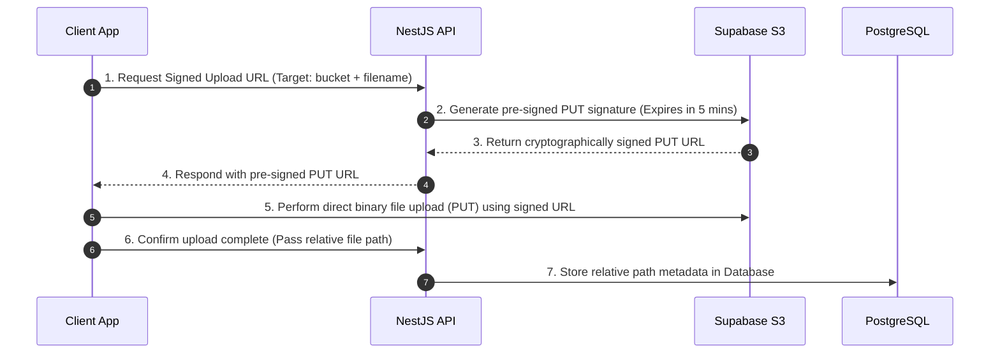

# RYDALUX Staging Object Storage Setup Guide

This document describes the step-by-step instructions, secure policies, environment variable mappings, and validation procedures required to provision and configure the **Supabase Storage Staging Environment** for RYDALUX.

---

## 1. Supabase Project Setup

1.  Navigate to **[Supabase.com](https://supabase.com)** and log in using your developer account.
2.  Click **New Project** → Select your connected organization.
3.  Configure the project properties:
    *   **Name**: `rydalux-staging-storage`
    *   **Database Password**: (Generate a strong random password and save it in a secure vault).
    *   **Region**: Select a European region (e.g. **`eu-west-1` Ireland** or **`eu-central-1` Frankfurt**). This is the optimal balance of availability, cost, and round-trip latency (~90-110ms RTT) to the Lagos pilot.
4.  Wait roughly 2 minutes for Supabase to provision the infrastructure.

---

## 2. Private Storage Buckets Configuration

To isolate file assets and maintain strict security borders, we will provision six independent, private buckets.

### 2.1 Bucket Registry & Upload Domains
Go to the **Storage** section in your Supabase project left sidebar and click **New Bucket** for each entry:

| Bucket Name | Purpose | Privacy | Max File Size | File Types Allowed |
| :--- | :--- | :---: | :---: | :--- |
| `driver-kyc-documents` | Driver license, background checks, and identity files. | **Private** | 10 MB | `.pdf`, `.jpg`, `.jpeg`, `.png` |
| `vehicle-documents` | Insurance certificates, registration, and roadworthiness files. | **Private** | 10 MB | `.pdf`, `.jpg`, `.jpeg`, `.png` |
| `shipment-proofs` | Package signatures captured during pickups and deliveries. | **Private** | 10 MB | `.jpg`, `.jpeg`, `.png`, `.webp` |
| `shipment-photos` | Parcel physical verification photos. | **Private** | 10 MB | `.jpg`, `.jpeg`, `.png`, `.webp` |
| `support-attachments` | User upload evidence screenshots for support cases. | **Private** | 10 MB | `.jpg`, `.jpeg`, `.png`, `.pdf` |
| `safety-incident-attachments` | Photos and reports uploaded during active SOS alerts. | **Private** | 10 MB | `.jpg`, `.jpeg`, `.png`, `.pdf` |

> [!CAUTION]
> **Privacy Lock:**
> During creation, ensure the **"Public bucket"** toggle is turned **OFF** for every single bucket. No folders or assets must be readable without cryptographic signature handshakes.

---

## 3. Cryptographically Signed URL Strategy

To ensure optimal file security and privacy compliance (including GDPR and NDPR), RYDALUX uses a double-blind, pre-signed URL strategy:

*   **Zero Public URLs**: No files are accessible via permanent public URLs.
*   **Signed Reads**: When an administrative operator logs in to view KYC files or shipment proofs, the NestJS API requests a short-lived, pre-signed download URL (`GET` signature expiring in **15 minutes**).
*   **Database Safety**: The PostgreSQL database strictly stores relative file paths (e.g. `driver-kyc-documents/license_user_1.pdf`) and metadata, never hardcoded API domains or raw secrets.

---

## 4. GitHub Staging Secrets Mapping

Locate your Supabase S3 credentials by going to **Project Settings** → **Storage**. Enable the S3 API and retrieve the parameters. Map these values into the secure GitHub Environment secrets dashboard (`Settings → Environments → staging → Environment secrets`):

| GitHub Secret Name | Supabase Parameter Value Source | Example Placeholder Format |
| :--- | :--- | :--- |
| `STAGING_STORAGE_ACCESS_KEY` | S3 Access Key ID from Supabase settings. | `sb_access_key_staging_12345` |
| `STAGING_STORAGE_SECRET_KEY` | S3 Secret Access Key from Supabase settings. | `sb_secret_key_staging_67890abcdef` |
| `STAGING_STORAGE_BUCKET` | The default staging bucket identifier. | `rydalux-staging-uploads` |
| `STAGING_STORAGE_REGION` | The region of your Supabase project datacenter. | `eu-west-1` |
| `STAGING_STORAGE_ENDPOINT` | The custom S3 Endpoint URL from Supabase settings. | `https://your-proj-id.supabase.co/storage/v1/s3` |

---

## 5. Railway API Environment Variable Mappings

The NestJS API gateway running on Railway reads S3 credentials via environment injections. Inside the Railway **API service** variables panel, map these local keys:

*   `STORAGE_PROVIDER` = `s3`
*   `STORAGE_S3_ACCESS_KEY` = `${{secrets.STAGING_STORAGE_ACCESS_KEY}}` *(Referencing the safe GitHub secret)*
*   `STORAGE_S3_SECRET_KEY` = `${{secrets.STAGING_STORAGE_SECRET_KEY}}`
*   `STORAGE_S3_ENDPOINT` = `${{secrets.STAGING_STORAGE_ENDPOINT}}`
*   `STORAGE_S3_REGION` = `${{secrets.STAGING_STORAGE_REGION}}`
*   `STORAGE_S3_BUCKET` = `${{secrets.STAGING_STORAGE_BUCKET}}`

---

## 6. Security Restraints & "What NOT to Do"

*   **NO PUBLIC ACCESS**: Never toggle the bucket configuration to public on the Supabase console, nor write public policy rules (`SELECT` allowed for everyone).
*   **NO EXPOSURE**: Never output S3 access or secret keys to `stdout/stderr` or NestJS service logs.
*   **NO PRODUCTION MIX-UP**: Staging Railway containers must strictly connect to the `rydalux-staging-storage` project. Production storage credentials are kept entirely separate.
*   **NO UNRESTRICTED SIZES**: Ensure you set the `10MB` file size restriction rules at the bucket configuration level on the Supabase dashboard to prevent Denial-of-Service (DoS) vector attacks via massive file uploads.

---

## 7. Manual Provisioning Validation Checklist

Ensure all checks pass before declaring Section 43 complete:

- [ ] **Supabase Staging Project Created**: Named `rydalux-staging-storage`.
- [ ] **All Six Buckets Provisioned**: All six buckets listed in Section 2 are created on the dashboard.
- [ ] **Private Settings Confirmed**: Double-checked that **every** bucket has public access disabled.
- [ ] **S3 API Enabled**: S3 API access toggle is turned on in Supabase settings.
- [ ] **GitHub Secrets Added**: Mapped Access Key, Secret Key, Endpoint, and Region into GitHub staging environment secrets.
- [ ] **No Secrets Committed**: Checked that no storage keys exist in local codebase configuration files.
